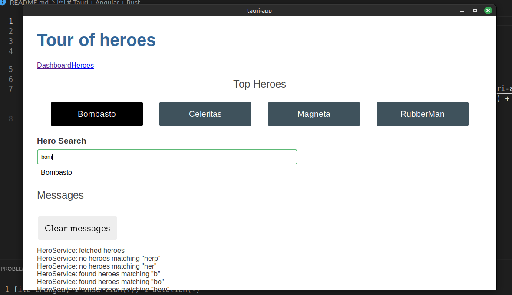
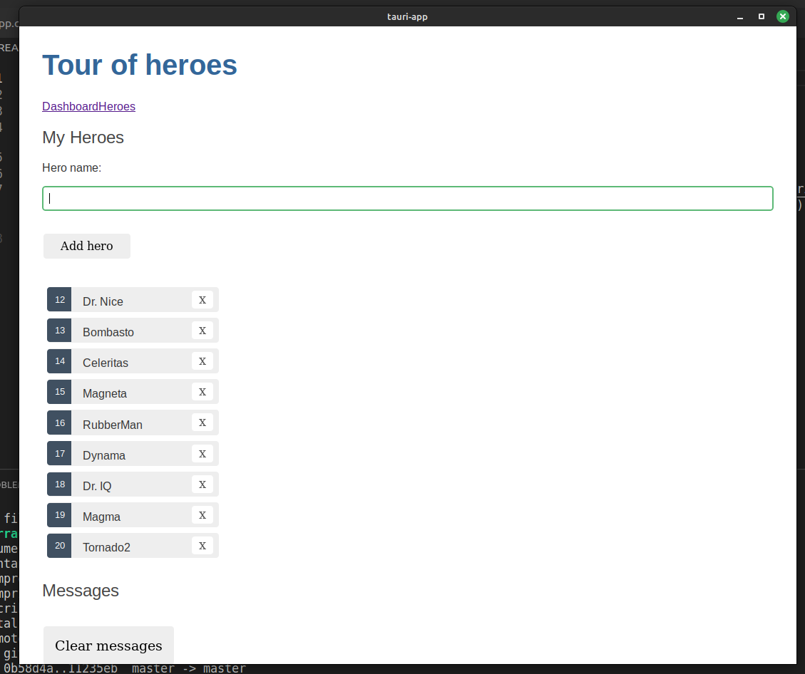
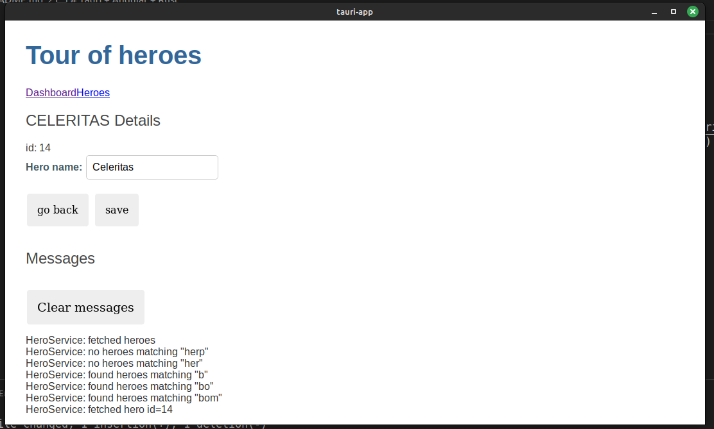

# Tauri + Angular + Rust

Se crea aplicación de escritorio usando Angular y Tauri. La aplicación es el tour of heroes que permite realizar un CRUD básico sobre una API basica de heroes.

Dashboard de la aplicación de escritorio en Linux.

Pantalla de lista de heroes.

Pantalla de detalles de un heroe.

This template should help get you started developing with Tauri and Angular.

## Recommended IDE Setup

[VS Code](https://code.visualstudio.com/) + [Tauri](https://marketplace.visualstudio.com/items?itemName=tauri-apps.tauri-vscode) + [rust-analyzer](https://marketplace.visualstudio.com/items?itemName=rust-lang.rust-analyzer) + [Angular Language Service](https://marketplace.visualstudio.com/items?itemName=Angular.ng-template).
